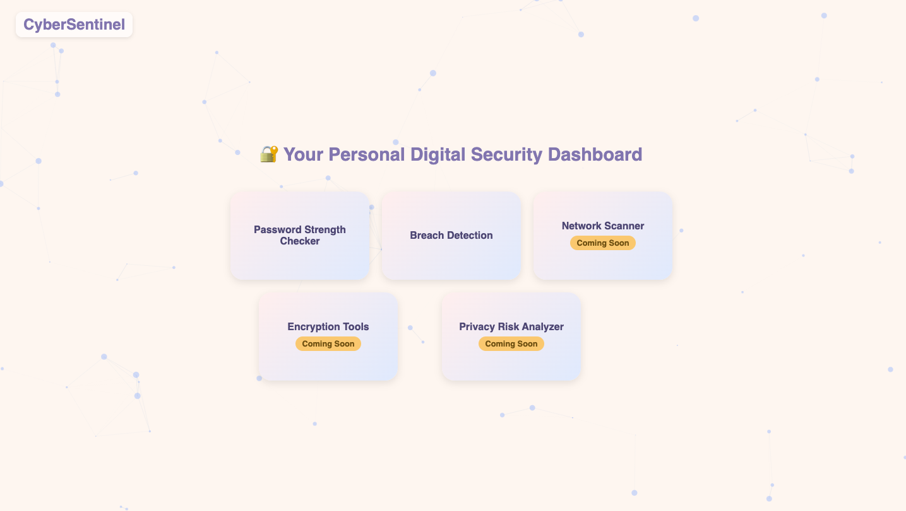
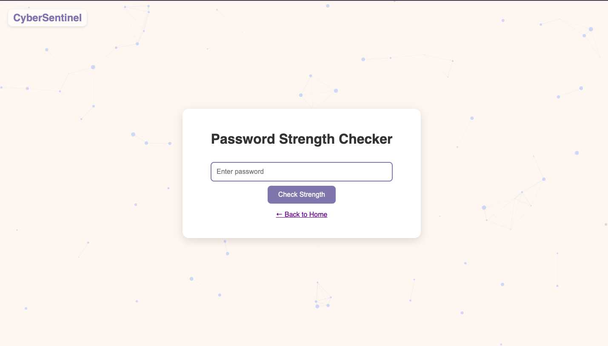
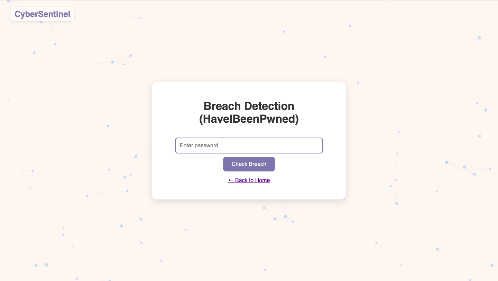

---

````markdown
# 🔐 CyberSentinel

*CyberSentinel* is a personal security dashboard that helps users assess and improve their digital hygiene. It currently includes tools for password strength analysis and breach detection using the HaveIBeenPwned API, with future expansion planned for network scanning and privacy risk assessment.

---

## 🚀 Features

- ✅ Password Strength Checker with smart scoring algorithms  
- ✅ Breach Detection using the [HaveIBeenPwned API](https://haveibeenpwned.com/API)  
- 🛠️ Simple and intuitive Flask-based web interface  
- 🧭 Future Modules (Coming Soon):
  - Network vulnerability scanner (Nmap integration)
  - Encryption utilities for file security
  - Privacy risk assessment tools

---

## 🧪 Technologies Used

- Python 3  
- Flask  
- HTML/CSS  
- Requests (for API communication)

---

## 📦 Installation

1. **Clone the Repository**

   ```bash
   git clone https://github.com/pranitha05/CyberSentinel.git
   cd CyberSentinel
````

2. **(Optional) Create a Virtual Environment**

   ```bash
   python -m venv venv
   source venv/bin/activate  # On Windows: venv\Scripts\activate
   ```

3. **Install Dependencies**

   ```bash
   pip install -r requirements.txt
   ```

---

## 🧑‍💻 Running the App

```bash
python run.py
```

Then open your browser and go to:
**`http://127.0.0.1:5000/`**

---

## 🛡️ API Used

* **HaveIBeenPwned API**
  Checks if a password has been exposed in known data breaches without sending the full password.

---


## 🤝 Contributing

Contributions are welcome!
Feel free to open an issue or submit a pull request to suggest improvements or report bugs.

---
## 🖥️ Screenshots

### 🧩 Dashboard View


### 🔐 Password Strength Checker


### 🕵️ Breach Detection


---

## 📌 Project Status

* ✅ Password Strength Analysis
* ✅ Breach Detection Module
* 🔄 Work in Progress:

  * Network Scanner (Nmap)
  * File Encryption Utility
  * Privacy Risk Analyzer

---

## 📄 License

This project is intended for **personal and educational use only**.
You are welcome to explore, modify, and expand on it as you wish!

---


