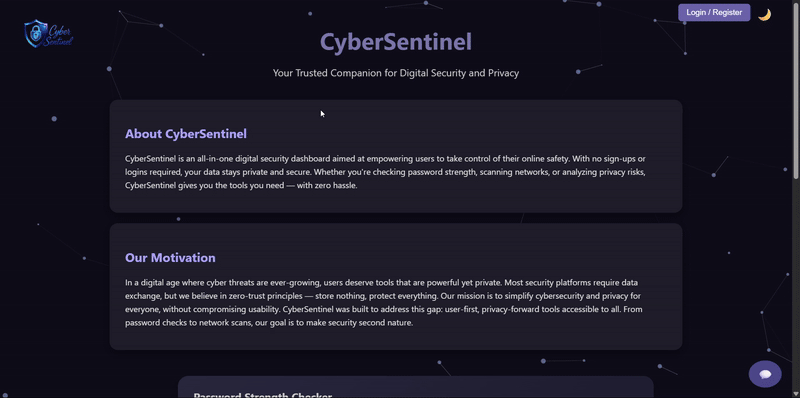
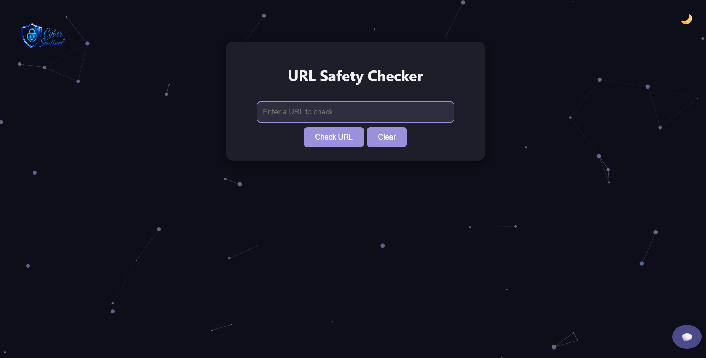
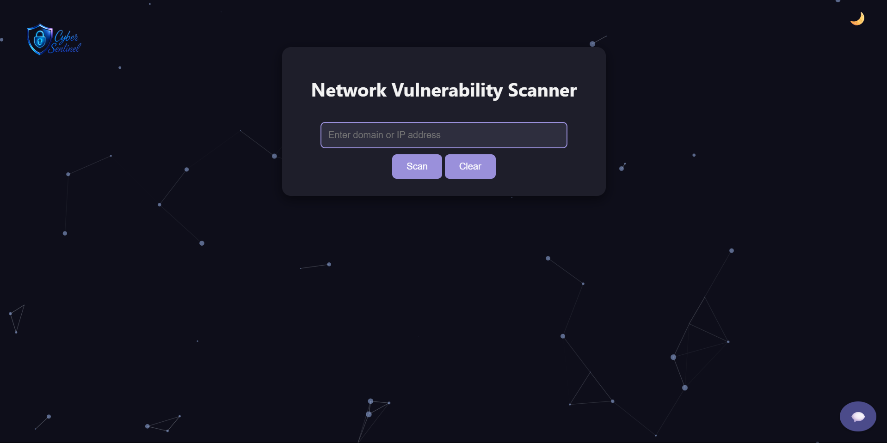
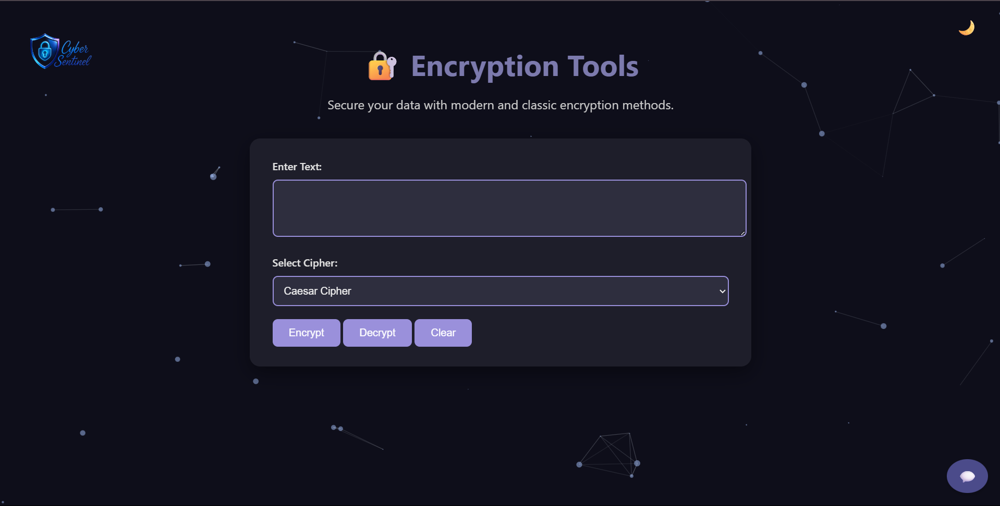
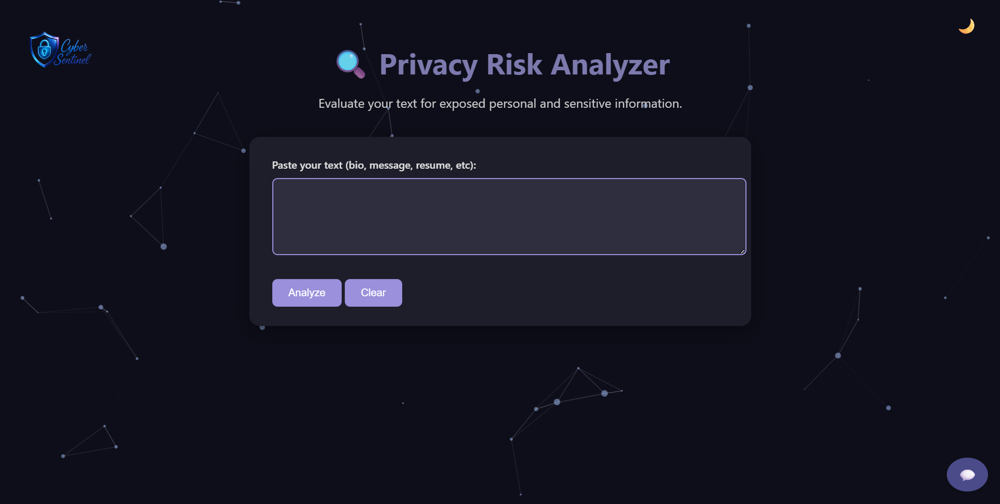
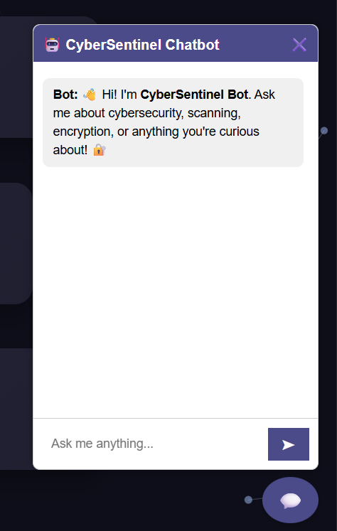

---


# 🔐 CyberSentinel

CyberSentinel is a personal security dashboard that helps users assess and improve their digital hygiene. It currently includes tools for password strength analysis and breach detection using the HaveIBeenPwned API, with future expansion planned for network scanning and privacy risk assessment.

---

## 🚀 Features

- ✅ Password Strength Checker with smart scoring algorithms  
- ✅ URL Safety Checker to detect phishing and malicious links  
- ✅ Network Scanner for scanning common open ports and identifying vulnerabilities  
- ✅ File Encryption Tools (Caesar, Base64, AES) with password-protected encryption/decryption  
- ✅ Privacy Risk Analyzer to detect exposure of sensitive data like emails, phone numbers, and Aadhaar  
- 💬 Integrated Gemini-Powered Chatbot for security assistance and awareness tips  


---

## 🖥️ Screenshots

### 🧩 Dashboard View


### 🔐 Password Strength Checker


### 🕵️ URL Privacy Checker


###🌐 Network Scanner


###🧬 Encryption Tools


###🧠 Privacy Risk Analyzer


###💬 AI Chatbot Assistant




---

## 🧪 Technologies Used

- Python 3  
- Flask  
- HTML/CSS  
- Requests (for API communication)

---

## 📦 Installation

1. **Clone the Repository**

   ```bash
   git clone https://github.com/pranitha05/CyberSentinel.git
   cd CyberSentinel
   ```

2. **(Optional) Create a Virtual Environment**

   ```bash
   python -m venv venv
   source venv/bin/activate   # On Windows: venv\Scripts\activate
   ```

3. **Install Python Dependencies**

   ```bash
   pip install -r requirements.txt
   ```

4. **Setup Firebase Admin SDK**

   * Place your `firebase-admin-sdk.json` file in the root directory.

5. **Create a `.env` File**

   Inside the root folder, create a `.env` file with the following content:

   ```env
   GEMINI_API_KEY=your_gemini_api_key_here
   FIREBASE_API_KEY=your_firebase_api_key
   FIREBASE_AUTH_DOMAIN=your_project.firebaseapp.com
   FIREBASE_PROJECT_ID=your_project_id
   FIREBASE_STORAGE_BUCKET=your_project.appspot.com
   FIREBASE_MSG_SENDER_ID=your_msg_sender_id
   FIREBASE_APP_ID=your_app_id
   FIREBASE_MEASUREMENT_ID=your_measurement_id
   ```

---

## 🧑‍💻 Running the App

```bash
python run.py
```

Then open your browser and go to:
**`http://127.0.0.1:5000/`**

---

## 🛡️ APIs & Services Used

* **Firebase Authentication** – For secure login using Email/Password & Google
* **Gemini API (by Google)** – Powers the AI-based chatbot assistant
* **Socket Module** – For port scanning functionality
* **Custom Regex-based Analysis** – For privacy scoring and sensitive data detection

---


## 🤝 Contributing

Contributions are welcome!
Feel free to open an issue or submit a pull request to suggest improvements or report bugs.

---

## 📄 License

This project is intended for **personal and educational use only**.
You are welcome to explore, modify, and expand on it as you wish!

---


